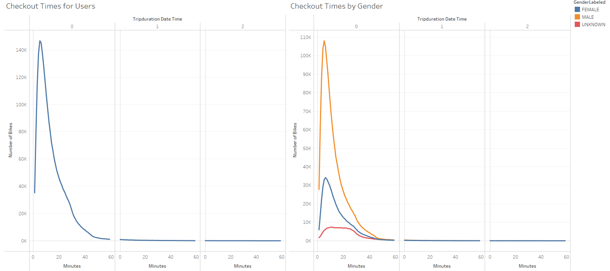
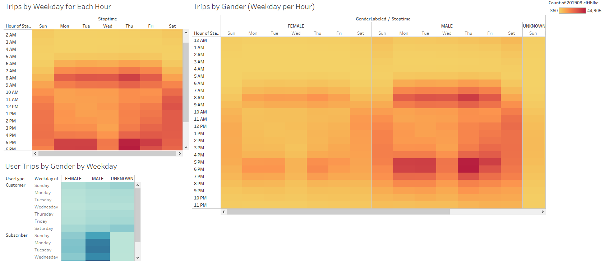
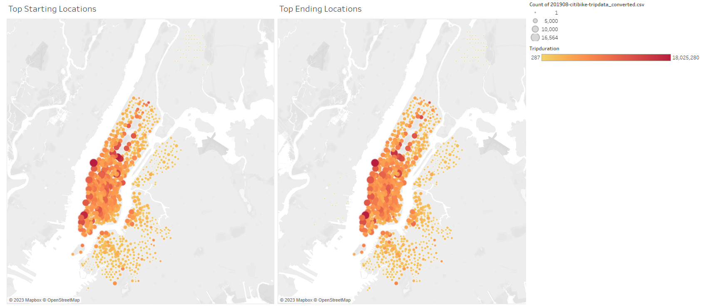

# Bike Sharing

  

## Overview of the Analysis

  

### Purpose
The purpose of this analysis is to convince the investors that a bike-sharing program in Des Moines is a solidify business proposal. To solidify said proposal, the investors will be presented with a series of visualizations to

- Show the length of time that bikes are checked out for all riders and genders.
- Show the number of bike trips for all riders and genders for each hours of each day of the week
- Show the number of bike trips for each type of user and gender for each day of the week
  

## Results

   
This visualization shows the check out times for all users on the left and the checkout times broken down by gender on the right.

This visualization contains three charts: Trips by Weekday for Each Hour, Trips by Gender (Weekday per Hour), and User Trips by Gender by Weekday. The point of these charts is to show the concentration of trips at certain times of the day by gender.

This visualization displays the starting and ending locations as well as the concentration of the trips.

## Summary
From these visualization, we can see that the highest concentration of trips occurs at the start and end of the workday; roughly 8 AM and 5 PM. We can also see that the most trips occur on Thursday and by subcribers as opposed to customers. There seems to be a large distinction in trips for customers versus subscribers, it'd be helpful to delve into that and create a visualization that would show the numeric distinction in trip numbers for customers versus subscribers. In addition, while seeing the geographic concentration of trips is nice, it'd be helpful to examine the concentration at various times of the day as well.
